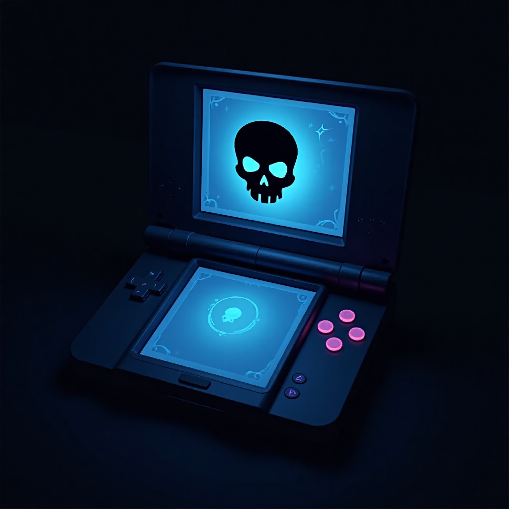
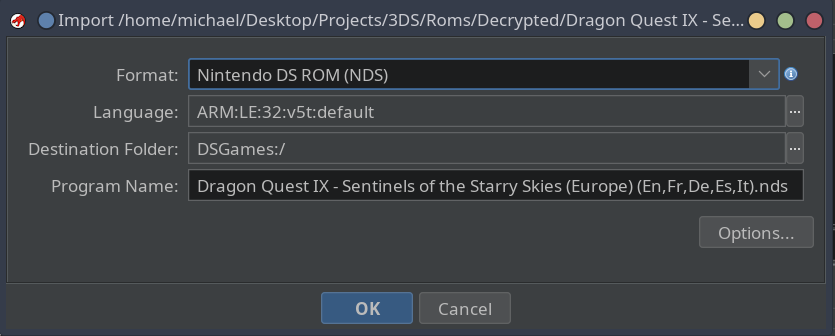

<p align="center">
    
</p>

# NDSWare

A suite of tools for reverse engineering Nintendo games (.nds).

The project includes:

- A Ghidra extension for loading NDS ROMs (`.nds`).
- Python-based command-line tools:
    - `extract_nds`
    - `extract_narc`
- Kaitai definitions for the NDS and NARC file formats.

## 📖 Requirements/Dependencies

The command line tools require the following Python packages:

- `click` (8.1.7),
- `kaitaistruct` (0.10)
- `tabulate` (0.9.0)

To compile the Ghidra extension, the following are required:

- Java Runtime Environment (tested on 23.0.1)
- Ghidra (tested on 11.3.2)

## 🛠️ Build

### Ghidra Extension

1. Set the path to your Ghidra install:
```bash
export GHIDRA_INSTALL_DIR=/path/to/ghidra
```
2. Run `make ghidra`.

This will create a ZIP file of the Ghidra extension in the project root directory. This can be installed into Ghidra by navigating to `File->Install Extensions` on the main menu.

### Command Line Tools

To compile and install the command line tools, simply run `make python`. It's recommended to run this within a Python environment to avoid complications.

## 🐉 Ghidra Extension

The Ghidra extension currently includes just a loader. The loader detects if the given binary is an NDS ROM and will select the correct language.



Upon importing the binary, the ARM9 main code and overlay sections are extracted from the NDS ROM and mapped into memory at their correct base addresses. The remaining uninitialized portions of the [memory map](https://problemkaputt.de/gbatek.htm#dsmemorymaps) are also set up accordingly.

The Ghidra extension does not yet support:

- Importing ARM7 main code and overlay sections.
- Decompiling Thumb (16-bit) instructions.
- Automatic labelling.

## 🖥️ Command Line Tools

### `extract_nds`

A command-line tool primarily for extracting files and code sections from NDS ROMs (`.nds`).

```bash
$ extract_nds 
Usage: extract_nds [OPTIONS] COMMAND [ARGS]...

  Extracts data from key sections of the NDS ROM such as game code and files.

Options:
  --help  Show this message and exit.

Commands:
  extract   Extracts data from key sections of the NDS ROM.
  files     Display files/directory structure.
  info      Display basic information about a NDS ROM.
  overlays  Display a table of overlay information from the NDS ROM.
  sections  List the data sections within a NDS ROM.

```

### `extract_narc`

A command-line tool for extracting files from a Nintendo Archive (`.narc`) file.

```bash
$ extract_narc 
Usage: extract_narc [OPTIONS] COMMAND [ARGS]...

  Extracts files from a Nintendo Archive (NARC).

Options:
  --help  Show this message and exit.

Commands:
  count        Count the number of files in a Nintendo Archive.
  extract      Extract files from a Nintendo Archive.
  extract-all  Extract all NARC files in a given directory.
  list         Show files and folders within a Nintendo Archive.
```

## 👏 Acknowledgements/References

This project builds on prior research conducted by others on the Nintendo DS. The following websites were particularly helpful.

- https://problemkaputt.de/gbatek.htm
- https://www.starcubelabs.com/reverse-engineering-d
- https://dsibrew.org/wiki/DSi_cartridge_header
- https://gbatemp.net/threads/pointer-tables.185458/
- https://wrongbaud.github.io/posts/writing-a-ghidra-loader/